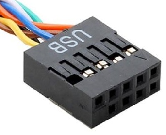

| Port | Cable | Name | Size | Year | Device | Usage | Notes
|:----:|:-----:|------|------|------|--------|-------|------
|  |  | USB 1.0/1.1 Type-A | 14×6.5mm 4 pins | 1996 | PCs. | | Always white. 1.5-12 Mb/s.
|  |  | USB 2.0 Type-A | 14×6.5mm 4 pins | 2000 | PCs. | | Usually white or black. 480 Mb/s.
|  |  | USB 3.0 Type-A | 14×6.5mm 9 pins | 2008 | PCs. | | Usually blue. 5 Gb/s. Also known as USB 3.1 Gen 1 or SuperSpeed 5.
|   |  | USB 3.1 Type-A | 14×6.5mm 9 pins | 2013 | PCs. | | Usually red, teal or blue. 10 Gb/s. Also known as USB 3.1 Gen 2, USB 3.2 Gen 2x1 or SuperSpeed 10.
|  |  | USB 3.2 Type-A | 14×6.5mm 9 pins | 2017 | PCs. | | Usually red or blue. 20 Gb/s. Also known as USB 3.2 Gen 2x2 or SuperSpeed 20.
|  |  | USB Sleep-and-Charge | 14×6.5mm 9 pins | 2008 | PCs. | | Provides power even when PC is on standby. Usually yellow.
|  |  | USB DAC-UP | 14×6.5mm 4 pins | 2010 | Gigabyte G1 motherboards. | | Gold-plated port for audio, functionally a USB 2.0 port. Always black with gold outer.
|  |  | USB DAC-UP 2 | 14×6.5mm 9 pins | 2016 | Gigabyte GA motherboards. | | Low-noise port for audio, functionally a USB 3.0 port. Always yellow.
|   |  | USB Qualcomm Quick Charge | 14×6.5mm 4 pins | 2015 | Qualcomm chargers. | | Usually green, teal or orange.
|  |  | USB 2.0 Type-B | 7.3×8.5mm 4 pins | 2000 | External drives, printers. | | Usually white or black.
|  |  | USB 3.0 Type-B | 8×10.4mm 9 pins | 2008 | External drives, printers. | | Usually blue.
|  |  | USB 2.0 Mini-A | 6.8×3mm 5 pins | 2000 | Cameras, phones. | Connect to PC or charger. | 
|  |  | USB 2.0 Mini-B | 6.8×3mm 5 pins | 2000 | Cameras, phones. | Connect to PC or charger. | 
|  |  | USB 2.0 Mini-AB | 6.8×3mm 5 pins | 2000 | | | Compatible with Mini-A and Mini-B connectors.
|  |  | Enhanced Mini USB | 6.8×?mm 10 pins | 2003 | Some Motorola phones. | Charger. | Similar to USB Mini with 5 additional pins for charging and audio.
|  |  | USB 2.0 Micro-A | 6.8×1.8mm 5 pins | 2007 | Cameras, phones. | Connect to PC or charger. | 
|  |  | USB 2.0 Micro-B | 6.8×1.8mm 5 pins | 2007 | Cameras, phones. | Connect to PC or charger. | 
|  |  | USB 2.0 Micro-AB | 6.8×1.8mm 5 pins | 2007 | | | Compatible with Micro-A and Micro-B connectors.
|  |  | USB 3.0 Micro-A | 12.2×1.8mm 10 pins | 2008 | | |
|  |  | USB 3.0 Micro-B | 12.2×1.8mm 10 pins | 2008 | External drives, Samsung phones. | Connect to PC. |
|  |  | USB 3.0 Micro-AB | 12.2×1.8mm 10 pins | 2008 | | | Compatible with Micro-A and Micro-B connectors.
|  |  | USB 3.0 Type-C | 8.3×2.6mm 24 pins | 2014 | Phones, tablets, laptops. | Charger. | Reversible.
|   |  | USB 4.0 Type-C | 8.3×2.6mm 24 pins | 2019 | Phones, tablets, laptops. | Charger. | Reversible. 20-120 Gb/s.
|  |  | USB 2.0 Header | ?mm 9 pins | 2000 | PC motherboard. | PC case USB ports. | Usually black. Port is sometimes white, yellow or blue.
|  |  | USB 2.0 Header (5-pin) | ?mm 5 pins | 2000 | | PC case USB ports. | Plugs into 9-pin header. Usually black.
|  |  | USB 2.0 Header (4-pin) | ?mm 4 pins | 2000 | | PC case USB ports. | Plugs into 9-pin header. Usually black.
|  |  | USB 3.0 Header | 20.8×5.4mm 19 pins | 2008 | PC motherboard. | PC case USB ports. | Usually blue or black.
|  |  | USB 3.1 Header Type-E | 11×4mm 20 pins | 2014 | PC motherboard. | PC case USB ports. | 