| Port | Cable | Name | Size | Year | Device | Usage | Notes
|:----:|:-----:|------|------|------|--------|-------|------
|  |  | IBM Monochrome Display Adapter (MDA) | 16.3×7.9mm 9 pins | 1981 | PC (with graphics card). | Monitor. | Uses DE-9 connector.
|  |  | Color Graphics Adapter (CGA) | 16.3×7.9mm 9 pins | 1981 | PC (with graphics card). | Monitor. | Uses DE-9 connector.
| 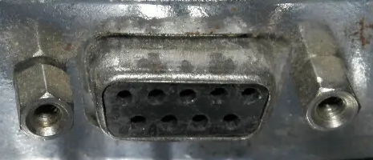 |  | Hercules Graphics Card (HGC) | 16.3×7.9mm 9 pins | 1982 | PC (with graphics card). | Monitor. | Uses DE-9 connector.
|  |  | Enhanced Graphics Adapter (EGA) | 16.3×7.9mm 9 pins | 1984 | PC (with graphics card). | Monitor. | Uses DE-9 connector.
| 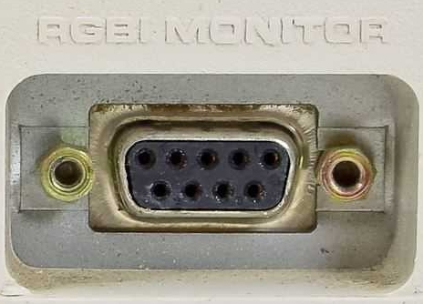 |  | Tandy Graphics Adapter (TGA) | 16.3×7.9mm 9 pins | 1984 | Tandy 1000 series PCs. | Monitor. | Uses DE-9 connector.
| 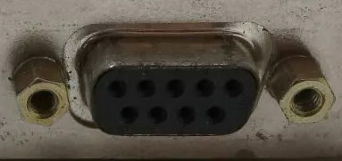 |  | Professional Graphics Controller (PGC) | 16.3×7.9mm 9 pins | 1984 | PC (with graphics card). | Monitor. | Uses DE-9 connector.
| 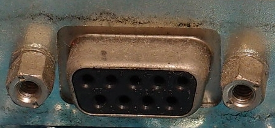 |  | Japanese Enhanced Graphics Adapter (JEGA) | 16.3×7.9mm 9 pins | 1987 | PC (with graphics card). | Monitor. | Uses DE-9 connector.
| 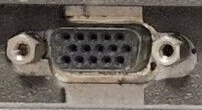 |  | Multi-Color Graphics Array (MCGA) | 16.3×7.9mm 15 pins | 1987 | IBM PS/2 Model 30. | Monitor. | Uses DE-15 connector.
| 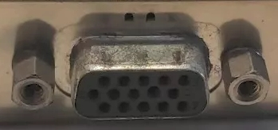 | 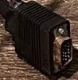 | IBM 8514 | 16.3×7.9mm 15 pins | 1987 | PC (with 8514 graphics card). | Monitor. | Uses DE-15 connector.
|  |  | Video Graphics Array (VGA) | 16.3×7.9mm 15 pins | 1987 | PC (motherboard or graphics card), laptops, Sega Dreamcast (with VGA adapter). | Monitor. | Uses DE-15 connector.
|  |  | Texas Instruments Graphics Architecture (TIGA) | 16.3×7.9mm 15 pins | 1989 | PC (with graphics card). | Monitor. | Uses DE-15 connector.
| 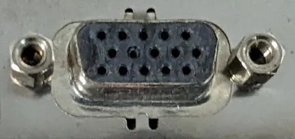 |  | Extended Graphics Array (XGA) | 16.3×7.9mm 15 pins | 1990 | PC (with graphics card). | Monitor. | Uses DE-15 connector.
| 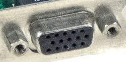 |  | Extended Video Graphics Array (EVGA) | 16.3×7.9mm 15 pins | 1991 | PC (with graphics card). | Monitor. | Uses DE-15 connector.
|  |  | Mini-VGA | ?mm 14 pins | 2002 | Apple iBooks, eMacs, some PowerBooks and iMacs; some Sony and HP laptops. | | 
| 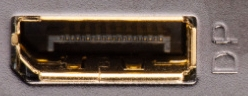 | 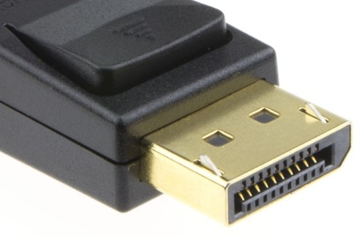 | DisplayPort | 16.1×4.8mm 20 pins | 2008 | PC (with graphics card), laptops. | Monitor. | 
| 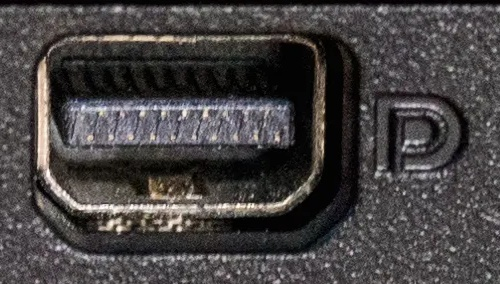 | 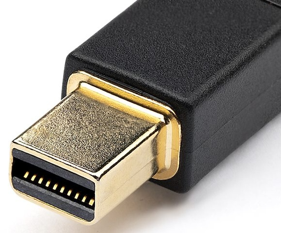 | Mini DisplayPort | 7.4×4.5mm 20 pins | 2008 | Laptops. | Monitor. | 