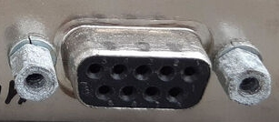
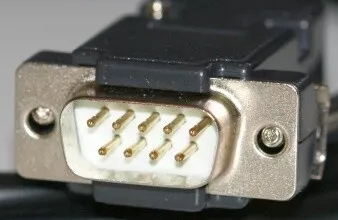
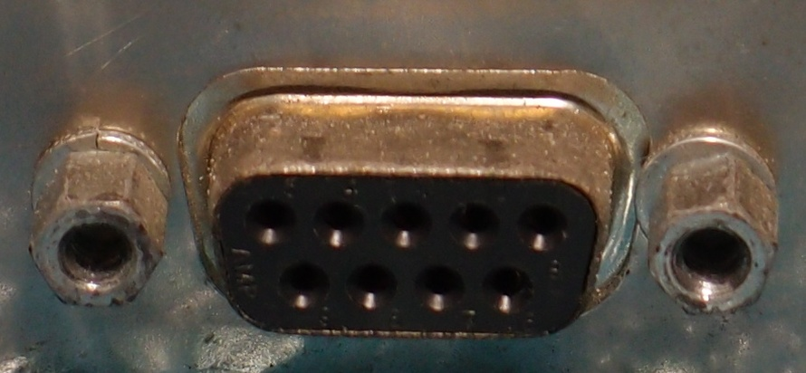
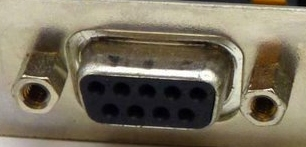
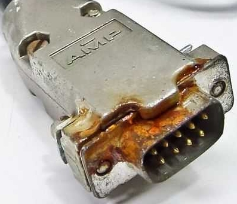
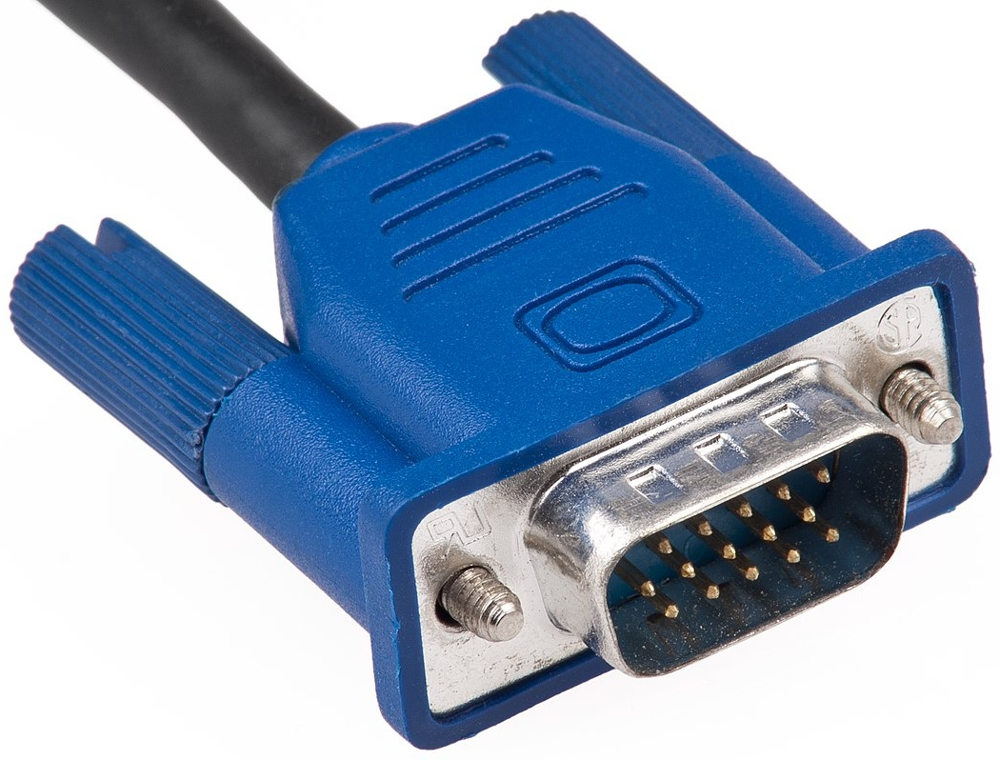
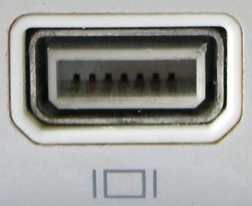
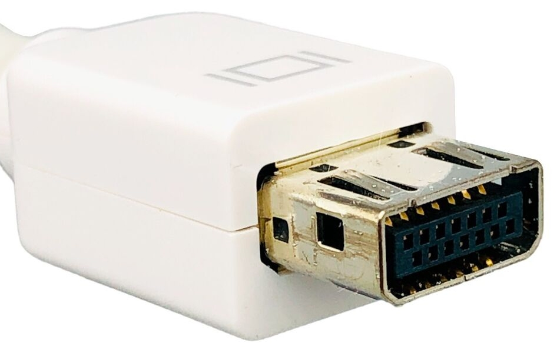

| Port | Cable | Name | Size | Year | Device | Usage | Notes
|:----:|:-----:|------|------|------|--------|-------|------
|  |  | IBM Monochrome Display Adapter (MDA) | 16.3×7.9mm 9 pins | 1981 | PCs. | Monochrome monitor. | Uses DE-9 connector.
|  |  | Color Graphics Adapter (CGA) | 16.3×7.9mm 9 pins | 1981 | PCs. | Monitor. | Uses DE-9 connector.
|  |  | Enhanced Graphics Adapter (EGA) | 16.3×7.9mm 9 pins | 1984 | PCs. | Monitor. | Uses DE-9 connector.
|  |  | Video Graphics Array (VGA) | 16.3×7.9mm 15 pins | 1987 | PCs, laptops, Sega Dreamcast (with VGA adapter). | Monitor. | Uses DE-15 connector.
|  |  | Mini-VGA | ?mm 14 pins | 2002 | Apple iBooks, eMacs, some PowerBooks and iMacs; some Sony and HP laptops. | | 